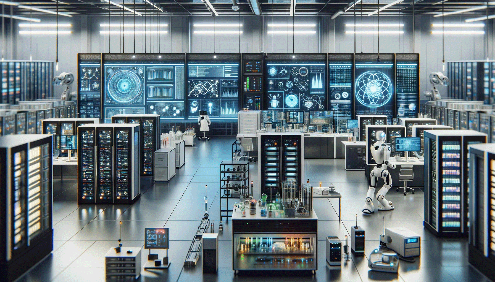

# Inteligencia Artificial y Aprendizaje Automático

---

**Fecha:** 27 de febrero a 21 marzo de 2024  

**Responsable:** Dr. Ulises Olivares Pinto  

**Auxiliares:** Alan Poisot Palacios, Joshelyn Yanori Mendoza Alfaro  

## Objetivo General
Desarrollar una comprensión profunda y aplicada de los principios y técnicas fundamentales de la inteligencia artificial y el aprendizaje profundo, capacitando a los participantes para diseñar, implementar y evaluar soluciones avanzadas en diversos contextos y problemas reales.

## Objetivos Específicos
- Entender los principios fundamentales de la IA y el aprendizaje profundo.
- Dominar el uso de redes neuronales en aplicaciones prácticas.
- Aplicar aprendizaje profundo a la visión por computadora y al NLP.
- Experimentar con la creación de datos mediante modelado generativo.
- Implementar aprendizaje por refuerzo para la toma de decisiones autónoma.
- Completar proyectos que integren teoría y práctica de IA.
- Seguir las tendencias actuales y emergentes en IA.
- Considerar la ética en el desarrollo y aplicación de la IA.

## **Modalidad:** 
>Presencial  
## **Prerrequisitos:** 
+ Computadora personal con acceso a internet
+ Cuenta de Gmail
+ Conocimientos básicos de programación.

## Temario

| Sesiones    | Tema                                                               | Subtemas                                                                                                                                                   | Material de Consulta                                                                                                     | Ejercicios y Demostraciones | Presentación                |
|-------------|--------------------------------------------------------------------|-------------------------------------------------------------------------------------------------------------------------------------------------------------|---------------------------------------------------------------------------------------------------------------------------|----------------------------|-----------------------------|
| Sesión 1    | Introducción a la IA y Aprendizaje Profundo                        | <ul><li>Historia y Fundamentos de la IA</li><li>Diferencias entre ML y AP</li><li>Aplicaciones y Casos de Éxito</li></ul>                                    | ["Artificial Intelligence: A Modern Approach" por Stuart Russell y Peter Norvig](https://www.amazon.com/Artificial-Intelligence-Modern-Approach-3rd/dp/0136042597) |   <ul><li>[Demo 1: Modelado generativo](https://colab.research.google.com/drive/1UXRuaYiXz6_S0KqZj2576AyQvpIES0UE?usp=sharing)</li><li>[Demo 2: YOLO](https://colab.research.google.com/drive/1oUqRgH4FXOQDDOx72Z1Pk7xwZrT0nSUq?usp=sharing)</li><li>[Demo 3: Reconocimiento de emociones](https://colab.research.google.com/drive/1Y3g8LIlzQOJ4OfiAKPJ9aAKqFrpHdNZj)</li><li>[Demo4: Generación de modelos 3D](https://colab.research.google.com/drive/1P6zzpwSPkiL3kezFM1Up47SAd5oKbaDk?usp=sharing)</li></ul>  | [Presentación](pdf/Día1.pdf) |
| Sesión 2    | Fundamentos de Redes Neuronales                                    | <ul><li>Conceptos Básicos de ANNs</li><li>Arquitecturas de Redes</li><li>Entrenamiento de Redes Neuronales</li></ul>                                          | ["Deep Learning" por Ian Goodfellow, Yoshua Bengio, y Aaron Courville](https://www.deeplearningbook.org/)                |     <ul><li>[Tensorflow Playground](https://playground.tensorflow.org/)</li><li>[Demo 1: Clasificación con perceptrón](https://colab.research.google.com/drive/17zvtUhmUkGVP1wu3m5FpzGDNF6UnQMsI?usp=sharing)</li> <li>[Demo 2: Redes Neuronales Profundas](https://colab.research.google.com/drive/1-WOqVdSS0STClNP8vKqzI9WJWkqj85N8?usp=sharing)</li> <li>[Demo 3: Clasificación con NN](https://colab.research.google.com/drive/1O2CWhWNR4Kozqcuh4vPtHxvC0gw5exnh?usp=sharing)</li> </ul>       | [Presentación](pdf/Día2.pdf) |
| Sesión 3    | Redes Neuronales Convolucionales (CNN)                             | <ul><li>Fundamentos y Arquitectura de CNNs</li><li>Aplicaciones en Visión por Computadora</li><li>Práctica con CNNs</li></ul>                                 | ["Convolutional Neural Networks for Visual Recognition" - Stanford University](http://cs231n.stanford.edu/)               |     <ul><li>[Demo 1: CNN y visualización de características](https://colab.research.google.com/drive/1Yj6sZSmVGXi4LSQidl_348Tgwej5ZkTO?usp=sharing)</li></ul> </ul>   | [Presentación](pdf/Día3.pdf) |
| Sesión 4    | Redes Neuronales Convolucionales (CNN) - Ejercicios y aplicaciones | <ul><li>Fundamentos y Arquitectura de CNNs</li><li>Aplicaciones en Visión por Computadora</li><li>Práctica con CNNs</li></ul>                                 | ["Convolutional Neural Networks for Visual Recognition" - Stanford University](http://cs231n.stanford.edu/)            | Ejercicios base:    <ul><li>[Código base: CIFAR 10](https://colab.research.google.com/drive/1pvMl2lZEvf-eU_foPbvKoH2s_TALnCKl?usp=sharing)</li> <li>[Aumento de datos](https://colab.research.google.com/drive/1XnvUNJcNrcizl7IvK1Eofj5NlQMi3jQq?usp=sharing)</li> <li>[Clasificación mejorada CIFAR-10](https://colab.research.google.com/drive/1az6cMOqynh95gKw4AbPhH7nrEi7lbb5u?usp=sharing)</li> </ul>  Ejercicios adicionales de clasificación:  <ul><li>[Fashion MNST](https://colab.research.google.com/drive/1wMXxhy5ek0DjR5vqqfr6iOKMFRznQxJf?usp=sharing)</li> <li>[Clasificación de flores](https://colab.research.google.com/drive/1lKeutpjkKAmYJv4oQGKdhaEfL2lVi_Xr?usp=sharing)</li> <li>[Clasificación de gestos](https://colab.research.google.com/drive/1cN8nM7GaWfs82qUYq6Or1LedsDGC1lCs?usp=sharing)</li> </ul> Demo final: <ul><li>[Captcha solver](https://drive.google.com/file/d/133UuyFfhHZ5wa1PFQJhKTFj3hlgsMgTW/view?usp=sharing)</li></ul> | [Presentación](pdf/Día4.pdf) |
| Sesión 5    | Redes Neuronales Recurrentes (RNN) y LSTMs                         | <ul><li>Arquitectura y Aplicaciones de RNNs y LSTMs</li><li>Procesamiento de Secuencias</li><li>Práctica con RNNs</li></ul>                                   | ["Understanding LSTM Networks" - Colah's Blog](http://colah.github.io/posts/2015-08-Understanding-LSTMs/)                |    <ul><li>[Ejercicio 1: Generación de siguiente número](https://colab.research.google.com/drive/1418EDiTqRffZs20sH2Gn3yjlmFymLoxW?usp=sharing)</li><li>[Ejercicio 2: Predicción de la siguiente palabra](https://colab.research.google.com/drive/14SLhdxifE8TWCEXSuKHwYZ_zjkLwpZJd?usp=sharing)</li><li>[Demo: RNN para generar música](https://colab.research.google.com/drive/1ILTSiCQNWt2fUo1Iyjen4PrnSUwN0_Ht?usp=sharing)</li></ul>         | [Presentación](pdf/Día5.pdf) |
| Sesión 6    | Redes Neuronales Recurrentes (RNN) y LSTMs (Aplicaciones)                         | <ul><li>Arquitectura y Aplicaciones de RNNs y LSTMs</li><li>Procesamiento de Secuencias</li><li>Práctica con RNNs</li></ul>                                   | ["Understanding LSTM Networks" - Colah's Blog](http://colah.github.io/posts/2015-08-Understanding-LSTMs/)                |    <ul><li> [Ejercicio 1: clasificación de sentimientos](https://colab.research.google.com/drive/1n7pvzOoYstPZIeHAj0ivBRjvlubMfosg?usp=sharing)</li><li>[Ejercicios con LSTMs](https://colab.research.google.com/drive/1WxP-AjpVHVzbG1p2Yq7Owq6fTKXDC-sH?usp=sharing)</li><li>[Demo 1: Aplicación de CNNs y RNNs](https://colab.research.google.com/drive/1wzEvlVjLRCMDGStePBHEp2e8Ir5Ex4qm?usp=sharing)</li> <li>[Demo 1 Resuelto: Aplicación de CNNs y RNNs](https://colab.research.google.com/drive/1z51cUEdYXaIoKTUeknfS-ewu6SAl-sdl?usp=sharing)</li> </ul>         | [Presentación](pdf/Día6.pdf) |
| Sesión 7    | Modelado Generativo                                         | <ul><li>Introducción al modelado generativo</li><li>Modelos de lenguage (LLMs)</li><li>Prácticas con Modelos Generativos</li></ul>                                                     | ["Generative Adversarial Nets" por Goodfellow et al.](https://arxiv.org/abs/1406.2661)                                    | <ul><li>[Demo 1: Aplicación de GANs](https://colab.research.google.com/drive/1thIEFde8W5DdhflpKqw23xxmu9UDHsbJ?usp=sharing)</li> </ul>                           | [Presentación](pdf/Día7.pdf) |
| Sesión 8    | Aplicaciones y proyectos finales    | <ul><li>Aplicaciones de DL</li><li>Presentación de proyectos finales</li></ul>                              | ["Natural Language Processing with Python" - Bird, Klein, y Loper](https://www.nltk.org/book/)                            |     <ul> <li>[Demo 1: Aplicación de NLP](https://colab.research.google.com/drive/1JrCy5FIWby414cjpayNv8gBCMn7ZQxtE?usp=sharing)</li> </ul>     | [presentación](pdf/Día8.pdf) |

#### Última modificación: 21 de marzo de 2024
